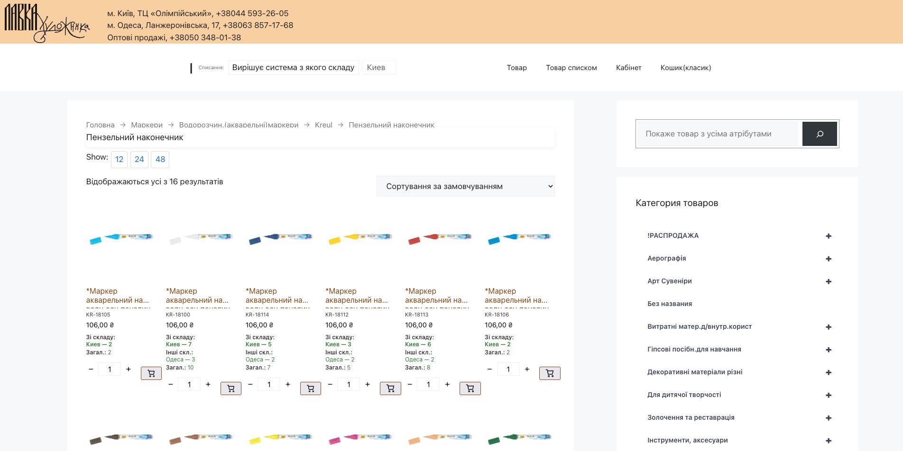
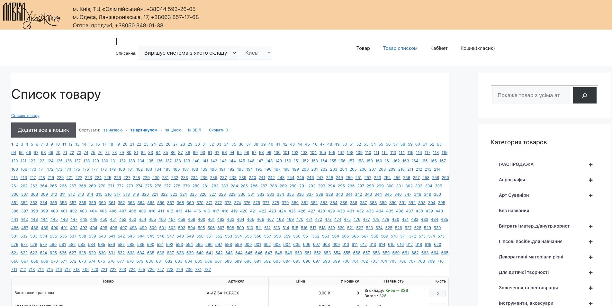
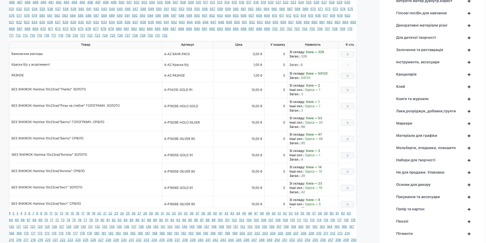
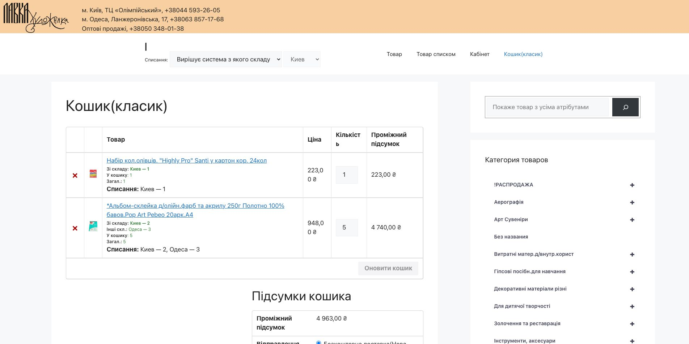
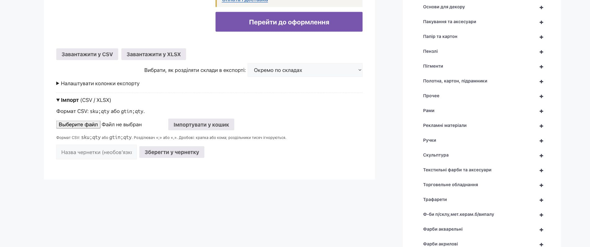

# Як оформити оптове замовлення на сайті KREUL

Ця інструкція призначена для оптових клієнтів «Лавки Художника». Вона пояснює,
як вибрати склад, замовити товар у каталозі або списком, імпортувати та
експортувати замовлення, працювати з чернетками, повторити старе замовлення,
перевірити розподіл у кошику, оформити замовлення та переглянути баланс і
документи ФОЛІО.

Перевірено на робочому сайті `kreul.com.ua` та за поточним кодом WordPress:
2026-09-03. Зображення нижче зроблено на реальних сторінках сайту без персональних
даних клієнтів.

## Швидкі посилання

- [Каталог товарів](https://kreul.com.ua/)
- [Товар списком](https://kreul.com.ua/shvydke-zamovlennia/)
- [Кошик](https://kreul.com.ua/cart_lh_klassick/)
- [Оформлення замовлення](https://kreul.com.ua/checkout/)
- [Особистий кабінет](https://kreul.com.ua/my-account/)
- [Мої замовлення](https://kreul.com.ua/my-account/orders/)
- [Баланс із клієнтом](https://kreul.com.ua/my-account/folio-balance/)
- [Документи ФОЛІО](https://kreul.com.ua/my-account/folio-documents/)
- [Як замовляти — інтерактивна інструкція](https://kreul.com.ua/my-account/yak-zamovyty/)

## Де знайти інструкцію на сайті

Після входу оптового клієнта пункт **«Як замовляти»** розташований в особистому
кабінеті безпосередньо перед пунктом **«Вийти»**. Інструкція доступна тим самим
оптовим ролям, що й сторінка **«Товар списком»**: партнеру, оптовому клієнту,
основному оптовому клієнту та школі. Звичайному покупцю і гостю вона не показується.

На пов'язаних сторінках сайту є компактне посилання **«Відкрити інструкцію»**. Воно
веде не на початок великого документа, а одразу до потрібного розділу:

- каталог і картка товару — до вибору товарів;
- «Товар списком» — до швидкого замовлення;
- кошик — до перевірки кошика, імпорту, експорту та чернеток;
- оформлення — до checkout і розділення по складах;
- «Мої замовлення» та деталі замовлення — до чернеток і повторного замовлення;
- баланс і документи ФОЛІО — до відповідних звітів.

Підтверджено локальним кодом `pc-wholesale-help` і role gate швидкого замовлення:
2026-09-03. Публічна адреса почне працювати після production deploy.

> Найпростіший варіант: увійдіть у кабінет, залиште режим **«Вирішує система з
> якого складу»**, додайте товари, перевірте рядки **«Списання»** у кошику та
> перейдіть до оформлення.

## 1. Перед початком

1. [Увійдіть в особистий кабінет](https://kreul.com.ua/my-account/).
2. У верхній частині сайту знайдіть поле **«Списання»**.
3. Виберіть режим роботи зі складами **до** додавання товарів.
4. Перевіряйте ціну після входу: вона залежить від умов вашого облікового запису.

Розділи **«Баланс із клієнтом»** і **«Документи ФОЛІО»** показуються лише
підключеним оптовим клієнтам. Якщо ви увійшли, але цих пунктів немає, зверніться до
оптового менеджера: ваш профіль потрібно зв'язати з контрагентом у ФОЛІО.

## 2. Як вибрати склад

У полі **«Списання»** є три режими.

| Режим | Як працює | Коли вибирати |
|---|---|---|
| **Вирішує система з якого складу** | Сайт сам розподіляє потрібну кількість між доступними складами. | Рекомендований режим, якщо головне — отримати весь доступний товар. |
| **З пріоритетом обраного** | Спочатку сайт бере товар з вибраного складу, а нестачу — з інших складів за системним пріоритетом. | Коли бажано отримати більшу частину товару з Києва або Одеси, але можна використати інший склад. |
| **Лише обраний склад** | Товар береться тільки з вибраного складу. Інші склади не використовуються. | Коли замовлення має бути повністю відвантажене з одного конкретного складу. |

Після вибору другого або третього режиму в сусідньому полі виберіть склад. Якщо
змінити режим або склад пізніше, сайт перераховує розподіл товарів у кошику — тому
перед оформленням ще раз перевірте рядки **«Списання»**.

Позначення залишків у каталозі:

- **«Зі складу»** — кількість на основному або вибраному складі;
- **«Інші скл.»** — кількість на інших складах;
- **«Загал.»** — загальна доступна кількість;
- **«Списання»** — точний план, з якого складу і скільки одиниць піде в це
  замовлення.

## 3. Спосіб 1 — каталог із картками товарів

Цей спосіб зручний, коли потрібно переглядати фото, категорії та варіанти товару.

1. Відкрийте [каталог](https://kreul.com.ua/).
2. Виберіть категорію та підкатегорію або скористайтеся пошуком.
3. У картці перевірте назву, артикул, ціну та залишки по складах.
4. Кнопками **−** і **+** або полем кількості задайте потрібну кількість.
5. Натисніть кнопку з кошиком.
6. Повторіть для інших товарів і відкрийте [кошик](https://kreul.com.ua/cart_lh_klassick/).



Якщо потрібної кількості немає на одному складі, у режимі автоматичного розподілу
сайт може взяти частину з іншого складу. У режимі **«Лише обраний склад»** додати
можна тільки доступну на ньому кількість.

## 4. Спосіб 2 — товар списком

Цей спосіб найзручніший для великого замовлення, коли відомі назви або артикули.

1. Відкрийте сторінку [«Товар списком»](https://kreul.com.ua/shvydke-zamovlennia/).
2. За потреби відсортуйте список **за назвою**, **за артикулом** або **за ціною**.
3. Кнопка **«Сховати 0»** прибирає позиції без доступного залишку; повторне
   перемикання повертає їх до списку.
4. У колонці **«К-сть»** введіть кількість для потрібних позицій.
5. Перевірте колонки **«У кошику»** та **«Наявність»**.
6. Натисніть **«Додати все в кошик»**. Сайт обробить усі рядки, де вказана
   кількість.
7. Відкрийте кошик і перевірте результат.



У таблиці показані товар, артикул, ціна, кількість уже в кошику, залишки та поле
для нової кількості.



Корисно знати:

- список має сторінки; додайте введені кількості до кошика перед переходом на
  іншу сторінку, щоб не втратити незбережені значення;
- доступна кількість залежить від вибраного режиму складу;
- якщо помилилися з кількістю, найпростіше виправити її у кошику;
- після натискання **«Додати все в кошик»** зверніть увагу на повідомлення про
  кількість вибраних і фактично доданих позицій.

## 5. Як перевірити кошик

У [кошику](https://kreul.com.ua/cart_lh_klassick/) перевірте кожну позицію:

1. назву та артикул товару;
2. ціну;
3. кількість;
4. проміжний підсумок;
5. рядок **«Списання»**.

Рядок `Списання: Київ — 2, Одеса — 3` означає, що п'ять одиниць одного товару
будуть зібрані з двох складів. Це нормальна робота автоматичного режиму.



Якщо розподіл не підходить:

- виберіть **«Лише обраний склад»**, якщо потрібна одна відправка з конкретного
  складу;
- або виберіть **«З пріоритетом обраного»**, якщо інші склади дозволені тільки
  для нестачі;
- після зміни режиму знову перегляньте весь кошик і його підсумок.

## 6. Як завантажити своє замовлення з файлу

Завантажити список товарів можна двома способами.

| Спосіб | Що відбудеться | Коли зручно |
|---|---|---|
| **Імпортувати у кошик** | Товари з файлу додаються до товарів, які вже є в кошику. | Коли файл перевірений і замовлення потрібно оформити зараз. |
| **Імпортувати у чернетку** | Створюється окрема чернетка в розділі «Мої замовлення». Поточний кошик не змінюється. | Для великого списку, який потрібно спочатку перевірити або завершити пізніше. |

### Який файл підготувати

Сайт приймає файли `.csv`, `.xlsx` та `.xls`. У першому рядку мають бути назви
колонок. Назви можуть бути українською, російською або англійською, а порядок
колонок не має значення. Можна [завантажити порожній шаблон CSV](examples/wholesale-order-template.csv),
[завантажити оформлений приклад Excel](examples/wholesale-order-template.xlsx) або
створити файл самостійно. Рядки в Excel-файлі є прикладами — перед імпортом
замініть або видаліть їх. Найпростіший CSV-файл має такий вигляд:

```csv
sku;qty
ABC-123;2
DEF-456;5
```

Замість артикула можна використовувати штрихкод:

```csv
gtin;qty
4820000000001;2
4820000000002;5
```

Підтримуються різні назви колонок:

| Призначення | Варіанти назв |
|---|---|
| Артикул товару | `sku`, `SKU`, `Артикул`, `Код`, `Код товару`, `Код продукту`, `article`, `part number`, `mpn`, `model`, `model sku` |
| Штрихкод | `gtin`, `GTIN`, `ean`, `ean13`, `ean-13`, `ean8`, `ean-8`, `upc`, `barcode`, `bar code`, `Штрих код`, `Штрих-код`, `Штрихкод` |
| Кількість | `qty`, `q-ty`, `quantity`, `qnt`, `count`, `Кількість`, `К-сть`, `Количество`, `К-во`, `шт`, `pcs`, `pieces` |
| Необов'язкова ціна для чернетки | `price`, `unit price`, `unitprice`, `cost`, `Ціна`, `Вартість` |

Наприклад, комбінація `gtin` + `q-ty` підтримується:

```csv
gtin;q-ty
4820000000001;2
4820000000002;5
```

Для CSV рекомендовано розділяти значення крапкою з комою `;`. Сайт також
розпізнає кому, табуляцію та вертикальну риску. Рядки з порожньою, нульовою або
від'ємною кількістю пропускаються. Якщо в одному рядку заповнені і штрихкод, і
артикул, сайт **спочатку шукає товар за GTIN/штрихкодом**. Лише якщо товар не
знайдено, виконується пошук за SKU/артикулом.

### Варіант A — одразу в кошик

1. Відкрийте [кошик](https://kreul.com.ua/cart_lh_klassick/).
2. Розгорніть блок **«Імпорт (CSV / XLSX)»**.
3. Виберіть файл і натисніть **«Імпортувати у кошик»**.
4. Перегляньте звіт по кожному рядку: додано, пропущено, товар не знайдено або
   сталася помилка.
5. Перевірте товари, кількість і **«Списання»** у кошику.

Імпорт **не очищає кошик**: нові позиції додаються до вже наявних. Ціна з файлу
не переноситься — сайт застосовує поточну ціну вашого облікового запису, поточну
наявність і вибраний режим складу.

### Варіант B — спочатку у чернетку

1. Відкрийте [«Мої замовлення»](https://kreul.com.ua/my-account/orders/).
2. Знайдіть блок **«Імпортувати у чернетку замовлення»**.
3. Виберіть файл, за бажанням введіть назву чернетки та натисніть
   **«Імпортувати у чернетку»**.
4. Перегляньте звіт імпорту та відкрийте створену чернетку.

Якщо назву не вказати, сайт використає назву файлу. Чернетка не надсилає лист про
нове замовлення і **не резервує товар**. Ціна з імпортованого файлу може залишитися
у чернетці для довідки, але під час перенесення до кошика сайт знову застосує
поточну ціну, наявність і правила складу.



## 7. Як вивантажити кошик або старе замовлення

Вивантаження доступне в [кошику](https://kreul.com.ua/cart_lh_klassick/) та на
сторінці перегляду кожного замовлення в
[«Моїх замовленнях»](https://kreul.com.ua/my-account/orders/).

1. За потреби натисніть **«Налаштувати стовпці»** та виберіть: артикул,
   штрихкод, назву, кількість, ціну, суму і примітки.
2. Виберіть спосіб показу складів:
   - **«Загальний»** — один рядок товару, а розподіл **«Списання»** записано у
     примітці;
   - **«Окремо по складах»** — окремий рядок для кожної складської частини.
3. Натисніть **«Завантажити у CSV»** або **«Завантажити у XLSX»**.

Файл кошика містить поточні ціни. Файл уже оформленого замовлення містить ціни,
які були записані в тому замовленні. Вивантаження нічого не змінює і не очищає.
Якщо XLSX тимчасово недоступний, сайт може запропонувати CSV.

## 8. Як зберегти поточний кошик у чернетку

1. Відкрийте [кошик](https://kreul.com.ua/cart_lh_klassick/).
2. За бажанням введіть зрозумілу назву, наприклад «Вересень — пензлі».
3. Натисніть **«Зберегти у чернетку»**.
4. Після переходу до [«Моїх замовлень»](https://kreul.com.ua/my-account/orders/)
   переконайтеся, що чернетка з'явилася у списку.

> **Важливо:** після успішного збереження кошик очищається. Товари переходять у
> чернетку, але не резервуються на складі. Коли ви повернете чернетку в кошик,
> ціни, наявність і розподіл по складах буде перевірено заново.

## 9. Як обробити чернетку

1. Відкрийте [«Мої замовлення»](https://kreul.com.ua/my-account/orders/).
2. Біля потрібної чернетки натисніть **«Обробити чернетку»**.
3. На сторінці чернетки виберіть один із двох способів.

### Доступний товар у кошик, відсутній — у ФОЛІО

Натисніть **«Завантажити доступну кількість у кошик»**. Спочатку сайт виконає
попередній перегляд (**preview**) і покаже таблицю:

- скільки було замовлено;
- скільки можна завантажити в кошик зараз;
- скільки залишиться у чернетці як відсутній товар.

Preview нічого не змінює в кошику і не записує у ФОЛІО. Лише після окремого
підтвердження (**apply**) сайт:

- замінить поточний кошик доступними товарами за актуальними цінами й залишками;
- залишить недоступну кількість у цій самій чернетці;
- створить для недоступного залишку один необліковий документ ФОЛІО на складі
  ФОЛІО **7** з позначкою **«нет на складе»**;
- переведе вас у кошик для звичайного оформлення замовлення.

Якщо доступна лише частина кількості одного товару, доступна частина потрапить у
кошик, а решта залишиться в чернетці. Необліковий документ не списує складські
залишки.

### Усю чернетку в необліковий документ ФОЛІО

Натисніть **«Передати всю чернетку в необліковий документ ФОЛІО»**, якщо це,
наприклад, передплачене замовлення товару, якого зараз немає. Спочатку перевірте
результат у **preview**, а потім окремо підтвердьте **apply**. Вся дійсна чернетка
буде записана одним необліковим документом на складі ФОЛІО **7** з позначкою
**«нет на складе»**. Поточний кошик не зміниться.

В обох сценаріях необліковий документ **не списує, не резервує і не переміщує
товарні залишки**. Це реєстрація потреби клієнта, а не складський рух.

> **Важливо:** перший спосіб **очищає і замінює поточний кошик**. Якщо його вміст
> потрібен, спочатку збережіть кошик в окрему чернетку або вивантажте у файл.

Якщо ФОЛІО повернула помилку, чернетка та її фактичний залишок зберігаються. Сайт
не повторює створення документа автоматично. Перевірте повідомлення й повторіть
підтвердження вручну з тим самим попереднім переглядом. Якщо після перегляду
змінилися позиції чернетки або розподіл залишків, сайт попросить виконати перевірку
заново.

Старе оформлене замовлення можна повторювати лише через доступні на його сторінці
дії. Перед додаванням завжди перевіряйте актуальні ціни, наявність і рядки
**«Списання»**.

Якщо потрібно взяти **лише окремі товари** зі старої покупки і не очищати поточний
кошик, зручніше повторити позиції з документа ФОЛІО — це описано в розділі 13.

## 10. Як оформити замовлення

1. У кошику натисніть кнопку переходу до оформлення або відкрийте
   [сторінку оформлення](https://kreul.com.ua/checkout/).
2. Перевірте ім'я, прізвище, телефон, email, місто та адресу отримувача. За
   потреби додайте примітку для менеджера.
3. Виберіть спосіб доставки. Якщо обрана Нова пошта, заповніть показані на
   сторінці поля відділення, поштомата або адресної доставки.
4. Виберіть доступний спосіб оплати. На сторінці можуть бути запропоновані оплата
   за рахунком, погоджена оплата готівкою або карткою через WayForPay.
5. Ще раз перевірте склад товарів, кількість, суму та доставку.
6. Підтвердьте замовлення один раз і дочекайтеся завершення обробки.

Після підтвердження сайт створює документи ФОЛІО та перевіряє склади. На екрані
може бути повідомлення з проханням зачекати. Не закривайте сторінку одразу і не
натискайте кнопку оформлення повторно.

Для оплати WayForPay документи ФОЛІО створюються після успішного підтвердження
оплати. Якщо оплата ще не підтверджена, замовлення може чекати її завершення.

Якщо обрана оплата за рахунком, після оформлення використовуйте реквізити, показані
сайтом або надані менеджером, і зазначайте номер замовлення у призначенні платежу.
Під час оплати карткою завершіть сторінку WayForPay і поверніться на сайт. Якщо
сторінка оплати закрилась або результат незрозумілий, спочатку перевірте
**«Мої замовлення»** і зверніться до менеджера — не сплачуйте вдруге навмання.

## 11. Чому замовлення може розділитися

ФОЛІО веде документи окремо по складах. Тому один кошик WooCommerce може стати
кількома замовленнями/рахунками — по одному на кожний склад, який бере участь у
відвантаженні.

Що саме може розділитися:

| Рівень | Що побачить клієнт |
|---|---|
| Одна товарна позиція | Її кількість може бути поділена, наприклад: `Київ — 2, Одеса — 3`. |
| Документи ФОЛІО | Для кожного складу створюється окремий складський документ. |
| Замовлення WooCommerce | Основне замовлення може отримати дочірні замовлення з окремими номерами, складами та статусами. |
| Доставка | Товари можуть готуватися до кількох відправлень. Остаточну кількість відправлень і ТТН видно після обробки або повідомляє менеджер. |
| Недоступний залишок | Може з'явитися окрема частина зі статусом очікування перевірки менеджером. |

Не сплачуйте дочірні замовлення окремо без чіткої вказівки менеджера: спочатку
перевірте результат початкової оплати та зв'язок дочірніх частин з основним
замовленням.

Можливі результати:

- **Усе з одного складу.** Залишається одне замовлення і один документ ФОЛІО.
- **Товар із кількох складів.** Основне замовлення стає загальним, а в кабінеті
  з'являються дочірні замовлення для окремих складів.
- **Частини товару бракує.** Доступна частина може бути оформлена, а залишок
  потрапляє на перевірку менеджеру зі статусом очікування.
- **Автоматична обробка не завершилась.** Замовлення зберігається, але потребує
  перевірки менеджера. Не створюйте дублікат, доки не з'ясовано стан першого
  замовлення.

У [«Моїх замовленнях»](https://kreul.com.ua/my-account/orders/) для розділеного
замовлення показуються посилання на його частини. Кожна частина може мати:

- окремий номер WooCommerce;
- окремий склад;
- окремий номер документа ФОЛІО;
- власний статус обробки або відвантаження.

Тобто кілька номерів після одного оформлення — не помилка і не кілька повторних
покупок. Це спосіб показати окремі складські документи.

## 12. Як переглянути баланс

1. Увійдіть у [кабінет](https://kreul.com.ua/my-account/).
2. Відкрийте [«Баланс із клієнтом»](https://kreul.com.ua/my-account/folio-balance/).
3. Виберіть початкову дату або **«За весь період»**.
4. Натисніть **«Сформувати звіт»**.
5. За потреби скористайтеся кнопками **«Експортувати XLSX»** або **«Друкувати»**.

У звіті можуть бути показані:

- початковий баланс;
- видаткові та прибуткові накладні;
- банківські та касові платежі;
- загальний борг;
- сума з відстроченням або на реалізації;
- прострочена сума;
- передплата;
- сума, яку потрібно сплатити зараз.

Нижче розміщена деталізація операцій: дата, тип і номер документа, підстава,
витрати, платежі, борг до та після операції, строк оплати і примітка.

## 13. Як переглянути документи ФОЛІО

1. Увійдіть у [кабінет](https://kreul.com.ua/my-account/).
2. Відкрийте [«Документи ФОЛІО»](https://kreul.com.ua/my-account/folio-documents/).
3. Вкажіть період. За замовчуванням показується період від дати, що була місяць
   тому, до сьогодні;
   максимальний період одного запиту — 366 днів.
4. Виберіть типи: **рахунки**, **видаткові накладні** та/або **платежі**.
5. Виберіть 25, 50 або 100 рядків на сторінці.
6. Натисніть **«Показати документи»**.

У списку видно тип, номер, дату, суму, склад ФОЛІО та доступні дії. Кнопка
**«Переглянути»** відкриває реквізити документа, товари, пов'язані платежі та
розподіл оплат.

Для рахунка або видаткової накладної можна повторити лише потрібні позиції:

1. Відкрийте документ кнопкою **«Переглянути»**.
2. Позначте потрібні рядки товарів.
3. Виберіть одну з дій:
   - **додати вибрані позиції до кошика** — вони додаються до вже наявних товарів,
     а кошик не очищається;
   - **зберегти вибрані позиції як чернетку** — створюється нова чернетка, а
     поточний кошик не змінюється.
4. Перевірте повідомлення про позиції, які додано або пропущено.

Стара ціна в документі показує лише історію. У новому кошику завжди застосовуються
поточні ціни, поточна наявність і поточний план списання. Створена чернетка не
резервує товар. Платежі та повернення не використовуються як шаблон повторного
замовлення. У кабінеті показуються активні документи; архівні документи у цьому
списку не показуються.

## 14. Якщо щось пішло не так

| Ситуація | Що робити |
|---|---|
| Немає пунктів «Баланс із клієнтом» або «Документи ФОЛІО» | Перевірте, що увійшли саме під оптовим обліковим записом. Якщо пунктів немає — зверніться до оптового менеджера для зв'язування профілю з ФОЛІО. |
| Поле кількості недоступне або наявність дорівнює нулю | Перевірте режим складу. У режимі «Лише обраний склад» товар на інших складах не використовується. |
| У кошику з'явилося кілька складів | Це автоматичний розподіл. Перевірте рядок «Списання»; за потреби змініть режим до оформлення. |
| Після імпорту деякі рядки не додані | Перегляньте звіт імпорту. Перевірте назви колонок, артикул або штрихкод і те, що кількість більша за нуль. Потім перевірте поточну наявність. |
| Після завантаження чернетки зникли товари з поточного кошика | Це очікувана поведінка: доступна частина чернетки замінює поточний кошик. Відновіть попередній кошик з окремої чернетки чи експортованого файлу, якщо ви їх зберегли. |
| Недоступний товар залишився у чернетці | Це очікувано. Після підтвердження він також має бути записаний у необліковому документі ФОЛІО з позначкою «нет на складе». |
| Документ ФОЛІО не створився | Не натискайте багато разів і не створюйте дублікат вручну. Перевірте показану помилку та повторіть підтвердження з тим самим попереднім переглядом або зверніться до менеджера. |
| Після оформлення з'явилося кілька замовлень | Відкрийте основне замовлення і його дочірні частини: кожна відповідає окремому складу. |
| Замовлення очікує перевірки менеджера | Не повторюйте оформлення. Передайте менеджеру номер WooCommerce і дочекайтеся підтвердження. |
| Оплату завершено, але документа ФОЛІО ще не видно | Оновіть «Мої замовлення» через кілька хвилин. Якщо документа немає, повідомте менеджеру номер WooCommerce та факт оплати; не сплачуйте повторно. |

## 15. Коротка перевірка перед підтвердженням

- Я увійшов/увійшла під своїм оптовим обліковим записом.
- Обрано правильний режим списання та, за потреби, склад.
- Якщо товари імпортовано, я перевірив/перевірила звіт по всіх рядках.
- Якщо завантажено чернетку або старе замовлення, я перевірив/перевірила новий
  вміст кошика.
- У кошику правильні товари, кількість і ціни.
- Рядки **«Списання»** відповідають очікуванню.
- Я розумію, що один кошик може бути розділено на кілька складських замовлень.
- Контактні дані, адреса, доставка та оплата перевірені.
- Після підтвердження я не натискатиму кнопку повторно, доки система обробляє
  замовлення.

Якщо потрібна допомога, повідомте менеджеру номер замовлення WooCommerce. Не
надсилайте в чаті пароль, дані банківської картки або інші секретні дані.
