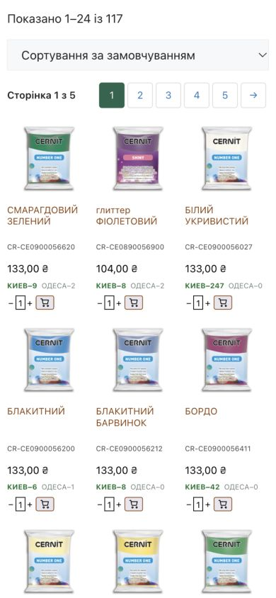
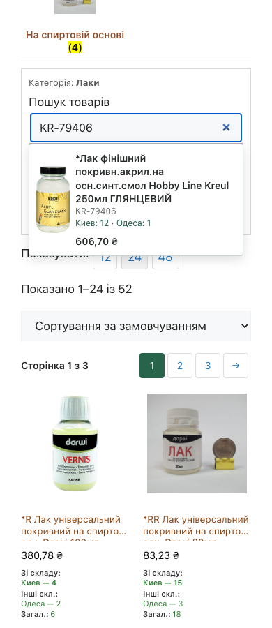
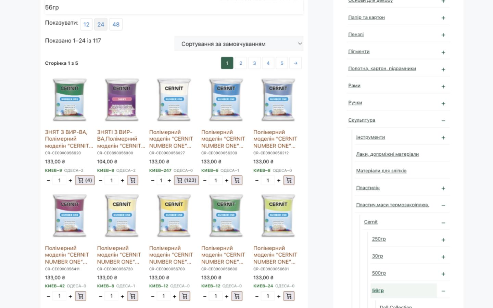
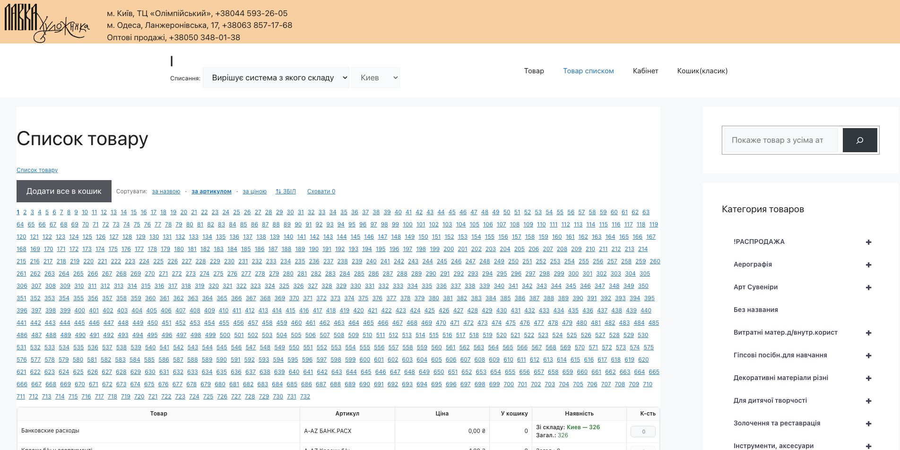
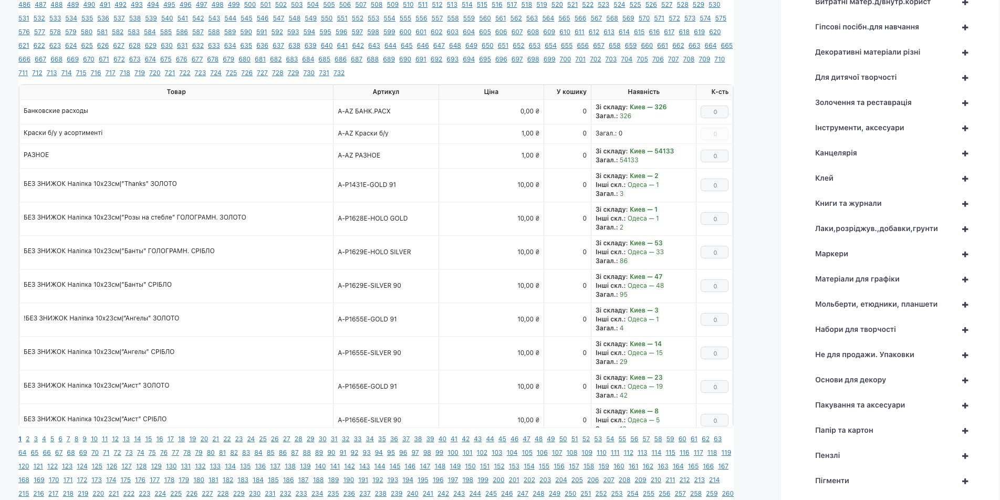
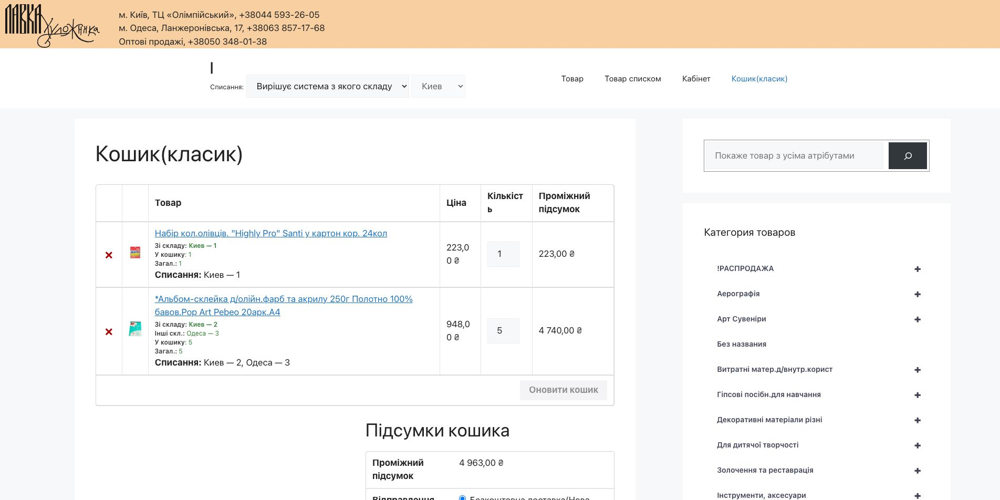
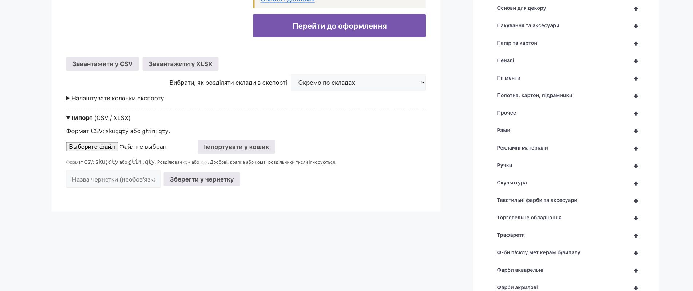
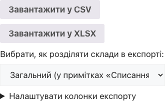

# Як оформити оптове замовлення на сайті KREUL

Ця інструкція призначена для оптових клієнтів «Лавки Художника». Вона пояснює,
як вибрати склад, замовити товар у каталозі або списком, імпортувати та
експортувати замовлення, працювати з чернетками, повторити старе замовлення,
перевірити розподіл у кошику, оформити замовлення та переглянути баланс і
документи ФОЛІО.

Перевірено на робочому сайті `kreul.com.ua` та за поточним кодом WordPress:
2026-09-03. Зображення нижче зроблено на реальних сторінках сайту без персональних
даних клієнтів.

## Швидкі посилання

- [Каталог товарів](https://kreul.com.ua/)
- [Товар списком](https://kreul.com.ua/shvydke-zamovlennia/)
- [Кошик](https://kreul.com.ua/cart_lh_klassick/)
- [Оформлення замовлення](https://kreul.com.ua/checkout/)
- [Особистий кабінет](https://kreul.com.ua/my-account/)
- [Мої замовлення](https://kreul.com.ua/my-account/orders/)
- [Баланс із клієнтом](https://kreul.com.ua/my-account/folio-balance/)
- [Документи ФОЛІО](https://kreul.com.ua/my-account/folio-documents/)
- [Як замовляти — інтерактивна інструкція](https://kreul.com.ua/my-account/yak-zamovyty/)

## Де знайти інструкцію на сайті

Після входу оптового клієнта пункт **«Як замовляти»** розташований в особистому
кабінеті безпосередньо перед пунктом **«Вийти»**. Інструкція доступна тим самим
оптовим ролям, що й сторінка **«Товар списком»**: партнеру, оптовому клієнту,
основному оптовому клієнту та школі. Звичайному покупцю і гостю вона не показується.

На пов'язаних сторінках сайту є компактне посилання **«Відкрити інструкцію»**. Воно
веде не на початок великого документа, а одразу до потрібного розділу:

- каталог і картка товару — до вибору товарів;
- «Товар списком» — до швидкого замовлення;
- кошик — до перевірки кошика, імпорту, експорту та чернеток;
- оформлення — до checkout і розділення по складах;
- «Мої замовлення» та деталі замовлення — до чернеток і повторного замовлення;
- баланс і документи ФОЛІО — до відповідних звітів.

Підтверджено локальним кодом `pc-wholesale-help` і role gate швидкого замовлення:
2026-09-03. Публічна адреса почне працювати після production deploy.

> Найпростіший варіант: увійдіть у кабінет, залиште режим **«Вирішує система з
> якого складу»**, додайте товари, перевірте рядки **«Списання»** у кошику та
> перейдіть до оформлення.

## 1. Перед початком

1. [Увійдіть в особистий кабінет](https://kreul.com.ua/my-account/).
2. У верхній частині сайту знайдіть поле **«Списання»**.
3. Виберіть режим роботи зі складами **до** додавання товарів.
4. Перевіряйте ціну після входу: вона залежить від умов вашого облікового запису.

Розділи **«Баланс із клієнтом»** і **«Документи ФОЛІО»** показуються лише
підключеним оптовим клієнтам. Якщо ви увійшли, але цих пунктів немає, зверніться до
оптового менеджера: ваш профіль потрібно зв'язати з контрагентом у ФОЛІО.

## 2. Як вибрати склад

Автоматичний розподіл доступний лише оптовим ролям. Над вибором складу показується
попередження: замовлення може розділитися між Києвом та Одесою на окремі відправлення.
Для звичайних роздрібних покупців і гостей є лише поле **«Магазин»**: Київ або
Одеса, без меню режимів і автоматичного добору з іншого міста. Склад зберігається
для кожної позиції під час додавання. Зміна магазину впливає лише на наступні
додавання, а не переносить попередні позиції. Один товар із двох магазинів буде
двома рядками кошика. Наявність інших складів залишається видимою: щоб придбати
товар звідти, спочатку свідомо переключіть магазин.
Стара роздрібна позиція з автоматичним розподілом між кількома складами потребує
повторного додавання після вибору магазину; сайт повідомить про це до оформлення.

Для оптових покупців у полі **«Списання»** залишаються три режими.

| Режим | Як працює | Коли вибирати |
|---|---|---|
| **Вирішує система з якого складу** | Сайт сам розподіляє потрібну кількість між доступними складами. | Рекомендований режим, якщо головне — отримати весь доступний товар. |
| **З пріоритетом обраного** | Спочатку сайт бере товар з вибраного складу, а нестачу — з інших складів за системним пріоритетом. | Коли бажано отримати більшу частину товару з Києва або Одеси, але можна використати інший склад. |
| **Лише обраний склад** | Товар береться тільки з вибраного складу. Інші склади не використовуються. | Коли замовлення має бути повністю відвантажене з одного конкретного складу. |

Після вибору другого або третього режиму в сусідньому полі виберіть склад. Якщо
змінити режим або склад пізніше, сайт перераховує розподіл товарів у кошику — тому
перед оформленням ще раз перевірте рядки **«Списання»**.

Позначення залишків у каталозі: назва кожного складу великими літерами та кількість
поруч; обидва склади в одному рядку, наприклад **КИЕВ–175 ОДЕСА–2**. Вибраний або перший для відвантаження склад
виділено жирним зеленим, інший показано світліше. Нуль означає відсутність товару
на цьому складі. Службові підписи «Зі складу», «Інші скл.» та «Загал.» у плитках
прибрано. На сторінці товару залишається докладний блок, а **«Списання»** в кошику
показує точний план відвантаження.

## 3. Спосіб 1 — каталог із картками товарів

Цей спосіб зручний, коли потрібно переглядати фото, категорії та варіанти товару.

1. Відкрийте [каталог](https://kreul.com.ua/).
2. Виберіть категорію або скористайтеся пошуком. Починаючи з другого рівня
   категорії, під плитками дочірніх розділів показуються всі товари вибраної
   гілки, включно з товарами з глибших підкатегорій.
   У боковому меню назва відкриває категорію, а **+** розгортає її підкатегорії.
   **−** згортає гілку; **«Ще категорії»** показує наступну частину списку.
   Поточну гілку розгорнуто й виділено. Якщо завантаження не вдалося, натисніть
   **«Повторити»** або перейдіть за назвою категорії. Без JavaScript користуйтеся
   посиланнями категорій та плитками підкатегорій на їхніх сторінках.
   У кабінеті та оформленні замовлення бокове дерево замінює
   **«Відкрити каталог»**.
3. За потреби одночасно застосуйте пошук за назвою, артикулом або штрихкодом,
   постачальника, одиницю виміру, склад, наявність і діапазон ціни. Відбір діє лише всередині
   поточної категорії та її підкатегорій; назву категорії видно над фільтрами.
   Кнопка **«Скинути»** повертає повний список цієї категорії.
   Використовуйте єдине поле над фільтрами: воно шукає також за описом та іншими
   індексованими полями. Від двох символів з’являються підказки з фото, вашою
   ціною та наявністю по складах; точний артикул стоїть першим. Підказки враховують
   поточну категорію та вибрані умови. Натисніть товар для відкриття картки або
   Enter без вибору підказки для звичайного пошуку. Якщо підказки недоступні,
   звичайний пошук продовжує працювати.
   У полі **«Одиниця виміру»** оберіть значення з картки ФОЛІО, наприклад
   **250 мл** або **125 мл**. Варіанти **«50 мл» / «50мл»** та **«шт» / «шт.»**
   об’єднано в одну опцію; вибір знаходить товари з обома записами. Це не кількість
   одиниць у фасовці. Значення в ФОЛІО не змінюються, різні об’єми не перераховуються.
   Списки одиниць, постачальників і складів містять значення товарів поточної
   категорії та її підкатегорій. Уже вибране значення можна прибрати і при порожній видачі.
   Значення не визначається з назви товару: якщо воно ще не передане з ФОЛІО,
   товар залишається доступним при виборі **«Усі одиниці»**.
   Без текстового пошуку товари згруповано за порядком постачальників, який задає
   магазин; текстовий пошук зберігає релевантність.
   У списку фільтра показуються обрані магазином постачальники, але без цього
   відбору доступні товари всіх постачальників. Опис товару відкривається у картці.
   Над товарами та під ними видно **«Сторінка X з Y»** і номери сторінок.
   Перехід між сторінками зберігає категорію та вибрані фільтри.
   Оберіть **12, 24 або 48** товарів на сторінці. Зміна кількості повертає
   на першу сторінку та зберігає фільтри. Зміна ширини екрана не перезавантажує
   каталог і не змінює вибрану кількість.
   На телефоні та комп’ютері додаткові поля сховані під **«Додаткові фільтри»**:
   постачальник, одиниця виміру, склади, наявність та ціна. Лічильник показує
   кількість активних груп умов. Згортання не скидає вибір; пошук, застосування
   та скидання залишаються видимими.
   Над товарами завжди видно застосовані умови у рядку **«Вибрано»**, навіть коли
   панель згорнута: пошук, одиницю, постачальника, кожен склад, наявність та межі ціни.
   **×** прибирає лише одну умову; **«Скинути все»** очищає всі обмеження,
   залишаючи поточну категорію, сортування та кількість товарів на сторінці.
   Зміна умов повертає на першу сторінку. Нові значення форми стають застосованими
   після натискання **«Застосувати фільтри»**.
   Мобільна шапка компактна, контакти й вибір складу збережені.
4. У плитці назва завжди займає три рядки; довшу назву обрізано з трьома крапками.
   Скорочене ім’я використовується лише в кінцевій підгрупі без видимих дочірніх
   категорій. Наприклад, у загальній групі «56гр» використовується повна назва. У пошуку та ширших розділах
   показується повне ім’я в межах трьох рядків. На сторінці товару — повна назва.
   Артикул видно також на телефоні; мобільна сітка містить три товари в рядку,
   зменшені фото та відступи: зовнішні поля 5 px, проміжки між рядами 8 px
   та між колонками 3,5 px. Перевірте ціну й залишки, а доступний штрихкод —
   після відкриття товару. Відступ між артикулом і ціною зменшено вдвічі.
   Якщо групі чи підгрупі не призначено окреме фото, показується фото товару з її
   гілки за встановленим магазином порядком постачальників. Товари без фото
   пропускаються; за відсутності всіх фото залишається плитка з назвою.
5. Кнопками **−** і **+** або полем кількості задайте потрібну кількість.
   Кількість і кнопка кошика залишаються в одному рядку, зокрема зі лічильником
   уже доданих одиниць. Кошик розташований одразу біля «+». На телефоні кнопки
   «−», «+» і кошик мають збільшену область натискання заввишки щонайменше 32 px.
6. Натисніть кнопку з кошиком.
7. Повторіть для інших товарів і відкрийте [кошик](https://kreul.com.ua/cart_lh_klassick/).







[Приклад меню категорій на телефоні](images/wholesale/category-menu-mobile.png).

Порожні гілки та категорії, приховані магазином, не показуються в меню.
Приховані магазином категорії також не показуються серед плиток на головній
та в підкатегоріях.
Батьківська категорія залишається, якщо товари є в її доступних підкатегоріях.
Враховуються лише опубліковані товари, видимі в каталозі: приховані товари та
чернетки не залишають порожню гілку в меню. Товари без наявності враховуються,
якщо магазин не ввімкнув їх приховування.

[Фільтр одиниць виміру на телефоні](images/wholesale/catalog-unit-filter-mobile.png).

[Вибрані фільтри при згорнутій панелі](images/wholesale/catalog-selected-filters-mobile.png).

Якщо потрібної кількості немає на одному складі, у режимі автоматичного розподілу
сайт може взяти частину з іншого складу. У режимі **«Лише обраний склад»** додати
можна тільки доступну на ньому кількість.

## 4. Спосіб 2 — товар списком

Цей спосіб найзручніший для великого замовлення, коли відомі назви або артикули.

1. Відкрийте сторінку [«Товар списком»](https://kreul.com.ua/shvydke-zamovlennia/).
2. За потреби відсортуйте список **за назвою**, **за артикулом** або **за ціною**.
3. Кнопка **«Сховати 0»** прибирає позиції без доступного залишку; повторне
   перемикання повертає їх до списку.
4. У колонці **«К-сть»** введіть кількість для потрібних позицій.
5. Перевірте колонки **«У кошику»** та **«Наявність»**.
6. Натисніть **«Додати все в кошик»**. Сайт обробить усі рядки, де вказана
   кількість.
7. Відкрийте кошик і перевірте результат.



У таблиці показані товар, артикул, ціна, кількість уже в кошику, залишки та поле
для нової кількості.



Корисно знати:

- список має сторінки; додайте введені кількості до кошика перед переходом на
  іншу сторінку, щоб не втратити незбережені значення;
- доступна кількість залежить від вибраного режиму складу;
- якщо помилилися з кількістю, найпростіше виправити її у кошику;
- після натискання **«Додати все в кошик»** зверніть увагу на повідомлення про
  кількість вибраних і фактично доданих позицій.

## 5. Як перевірити кошик

Кошик займає всю ширину сторінки без бокової колонки. На телефоні кожна позиція
містить фото й повну назву, а нижче — ціну, кількість і підсумок. Змініть кількість
у полі або натисніть хрестик, щоб прибрати позицію.

[Приклад кошика на телефоні](../wp-content/mu-plugins/pc-wholesale-help/assets/images/cart-compact-mobile.jpg).

У [кошику](https://kreul.com.ua/cart_lh_klassick/) перевірте кожну позицію:

1. назву та артикул товару;
2. ціну;
3. кількість;
4. проміжний підсумок;
5. рядок **«Списання»**.

Рядок `Списання: Київ — 2, Одеса — 3` означає, що п'ять одиниць одного товару
будуть зібрані з двох складів. Це нормальна робота автоматичного режиму.

Зміна кількості та видалення позиції оновлюють лише потрібний рядок і підсумки
кошика. Поки триває запит, біля кількості видно стан **«Оновлення кошика…»**. Не
потрібно перезавантажувати сторінку або повторно натискати кнопку.



Якщо розподіл не підходить:

- виберіть **«Лише обраний склад»**, якщо потрібна одна відправка з конкретного
  складу;
- або виберіть **«З пріоритетом обраного»**, якщо інші склади дозволені тільки
  для нестачі;
- після зміни режиму знову перегляньте весь кошик і його підсумок.

## 6. Як завантажити своє замовлення з файлу

Завантажити список товарів можна двома способами.

| Спосіб | Що відбудеться | Коли зручно |
|---|---|---|
| **Імпортувати у кошик** | Товари з файлу додаються до товарів, які вже є в кошику. | Коли файл перевірений і замовлення потрібно оформити зараз. |
| **Імпортувати у чернетку** | Створюється окрема чернетка в розділі «Мої замовлення». Поточний кошик не змінюється. | Для великого списку, який потрібно спочатку перевірити або завершити пізніше. |

### Повний прайс для замовлення

У **«Моїх замовленнях»** та в кошику доступна кнопка **«Завантажити повний прайс
(XLSX)»**. Поки файл готується, відображається стан очікування. Доступ мають
авторизовані оптові клієнти.

У файлі є артикул, перевірений штрихкод (якщо є), назва, постачальник, категорія,
**одна ваша поточна ціна** за умовами облікового запису, **спільний залишок Києва
та Одеси**, жовта колонка **«Замовити»** та посилання **«Інформація про товар»**.
Прайс охоплює весь опублікований каталог, доступний у каталозі сайту, з артикулами,
включно з товарами без залишку. Прихованих товарів і батьківських рядків варіативних
товарів у ньому немає: варіанти з власними артикулами є окремими рядками.
Якщо ціна чи залишок невідомі, клітинка порожня, а не нульова.

Прайс повторює дерево видимих категорій сайту: окремі темно-бордові заголовки груп і
підгруп, під ними — товари. Кнопки **+/−** і рівні структури зліва в Excel
згортають та розгортають розділи. Групи впорядковані за абеткою, як у каталозі;
товари всередині розділу — за налаштованим порядком постачальників і назвою.
Кожний товар наведений один раз: в основній видимій призначеній категорії або,
якщо її немає, у найглибшій видимій призначеній підгрупі. Колонка категорії показує
повний шлях. Приховані в налаштуваннях сайту групи та всі їхні підгрупи не
потрапляють у прайс. Товари без видимої категорії також не включені; якщо товар
належить і до прихованої, і до видимої групи, він залишається у видимій.
Налаштування видимості враховуються під час кожного нового завантаження.

1. Завантажте прайс під власним обліковим записом. Розгорніть потрібні групи
   та підгрупи кнопками структури Excel. Не сортуйте весь аркуш як плоску таблицю:
   це змішає заголовки розділів з товарами.
2. Впишіть потрібну кількість лише в **«Замовити»**. Не перейменовуйте шапку та
   не змінюйте артикули. Порожні клітинки й нулі не створюють позицій замовлення.
   Імпортуються всі заповнені рядки, у тому числі у згорнутих розділах.
   Заголовки груп не створюють позицій замовлення.
3. Збережіть XLSX і завантажте його у чернетку або кошик через звичайний імпорт.
   Чернетка зберігає запитану кількість незалежно від залишку; кошик перевіряє
   поточну доступність і режим складу. Файл без замовлених кількостей не створює
   порожню чернетку.
4. Перевірте звіт. Для цього прайса товар визначається за артикулом, а ціни
   беруться заново із сайту, не з Excel. Від'ємні, нечислові значення та формули
   в колонці замовлення не приймаються. Залишок у прайсі не є резервом.

### Комерційна пропозиція від менеджера

Менеджер може надіслати вам комерційну пропозицію в Excel: таблицю з групами та підгрупами категорій, з вашими цінами, описами й доступними фото. Жовта колонка «Замовити» порожня; наявні залишки показано окремо. Перед імпортом введіть кількості: залиште лише те, що хочете замовити, а інші рядки очистьте або поставте нуль. Ціни та залишки зафіксовані під час підготовки розсилки; під час замовлення сайт перевіряє актуальні ціни й наявність.

### Який файл підготувати самостійно

Сайт приймає файли `.csv`, `.xlsx` та `.xls`. У першому рядку мають бути назви
колонок. Назви можуть бути українською, російською або англійською, а порядок
колонок не має значення. Можна [завантажити порожній шаблон CSV](examples/wholesale-order-template.csv),
[завантажити оформлений приклад Excel](examples/wholesale-order-template.xlsx) або
створити файл самостійно. Рядки в Excel-файлі є прикладами — перед імпортом
замініть або видаліть їх. Найпростіший CSV-файл має такий вигляд:

```csv
sku;qty
ABC-123;2
DEF-456;5
```

Замість артикула можна використовувати штрихкод:

```csv
gtin;qty
4820000000001;2
4820000000002;5
```

Підтримуються різні назви колонок:

| Призначення | Варіанти назв |
|---|---|
| Артикул товару | `sku`, `SKU`, `Артикул`, `Код`, `Код товару`, `Код продукту`, `article`, `part number`, `mpn`, `model`, `model sku` |
| Штрихкод | `gtin`, `GTIN`, `ean`, `ean13`, `ean-13`, `ean8`, `ean-8`, `upc`, `barcode`, `bar code`, `Штрих код`, `Штрих-код`, `Штрихкод` |
| Кількість | `qty`, `q-ty`, `quantity`, `qnt`, `count`, `Кількість`, `К-сть`, `Количество`, `К-во`, `шт`, `pcs`, `pieces` |
| Ціна (для клієнтського імпорту ігнорується) | `price`, `unit price`, `unitprice`, `cost`, `Ціна`, `Вартість` |

Наприклад, комбінація `gtin` + `q-ty` підтримується:

```csv
gtin;q-ty
4820000000001;2
4820000000002;5
```

Для CSV рекомендовано розділяти значення крапкою з комою `;`. Сайт також
розпізнає кому, табуляцію та вертикальну риску. Рядки з порожньою, нульовою або
від'ємною кількістю пропускаються. Якщо в одному рядку заповнені і штрихкод, і
артикул, у звичайному файлі сайт **спочатку шукає товар за GTIN/штрихкодом**. Лише якщо товар не
знайдено, виконується пошук за SKU/артикулом.

### Варіант A — одразу в кошик

1. Відкрийте [кошик](https://kreul.com.ua/cart_lh_klassick/).
2. Розгорніть блок **«Імпорт (CSV / XLSX)»**.
3. Виберіть файл і натисніть **«Імпортувати у кошик»**.
4. Перегляньте звіт по кожному рядку: додано, пропущено, товар не знайдено або
   сталася помилка.
5. Натисніть **«Оновити список»**, потім перевірте товари, кількість і **«Списання»**
   у кошику. Звіт не зникає автоматично: спочатку збережіть потрібні відомості
   про пропуски. Не запускайте імпорт повторно, якщо товари вже додані.

Імпорт **не очищає кошик**: нові позиції додаються до вже наявних. Ціна з файлу
не переноситься — сайт застосовує поточну ціну вашого облікового запису, поточну
наявність і вибраний режим складу.

### Варіант B — спочатку у чернетку

1. Відкрийте [«Мої замовлення»](https://kreul.com.ua/my-account/orders/).
2. Знайдіть блок **«Імпортувати у чернетку замовлення»**.
3. Виберіть файл, за бажанням введіть назву чернетки та натисніть
   **«Імпортувати у чернетку»**.
4. Перегляньте звіт імпорту та відкрийте створену чернетку.

Якщо назву не вказати, сайт використає назву файлу. Чернетка не надсилає лист про
нове замовлення і **не резервує товар**. Клієнтська чернетка використовує поточні
ціни вашого облікового запису, а не ціну з файлу. Лише менеджер може імпортувати
довільні ціни у звичайну чернетку. Під час перенесення до кошика сайт знову
застосує поточну ціну, наявність і правила складу.



## 7. Як вивантажити кошик або старе замовлення

Вивантаження доступне в [кошику](https://kreul.com.ua/cart_lh_klassick/) та на
сторінці перегляду кожного замовлення в
[«Моїх замовленнях»](https://kreul.com.ua/my-account/orders/).

1. За потреби натисніть **«Налаштувати стовпці»** та виберіть: артикул,
   штрихкод, назву, кількість, ціну, суму і примітки.
2. Виберіть спосіб показу складів:
   - **«Загальний»** — один рядок товару, а розподіл **«Списання»** записано у
     примітці;
   - **«Окремо по складах»** — окремий рядок для кожної складської частини.
3. Натисніть **«Завантажити у CSV»** або **«Завантажити у XLSX»**.

На телефоні список способів показу складів розташований під підписом і займає
ширину блоку. Обидва варіанти доступні без горизонтального прокручування.



Перевірено локально 27.09.2026 на ширині 320–1280 px; публікація оновленого
вигляду та знімка у «Як замовляти» потребує deploy.

Файл кошика містить поточні ціни. Файл уже оформленого замовлення містить ціни,
які були записані в тому замовленні. Вивантаження нічого не змінює і не очищає.
Якщо XLSX тимчасово недоступний, сайт може запропонувати CSV.

## 8. Як зберегти поточний кошик у чернетку

1. Відкрийте [кошик](https://kreul.com.ua/cart_lh_klassick/).
2. За бажанням введіть зрозумілу назву, наприклад «Вересень — пензлі».
3. Натисніть **«Зберегти у чернетку»**.
4. Після переходу до [«Моїх замовлень»](https://kreul.com.ua/my-account/orders/)
   переконайтеся, що чернетка з'явилася у списку.

> **Важливо:** після успішного збереження кошик очищається. Товари переходять у
> чернетку, але не резервуються на складі. Коли ви повернете чернетку в кошик,
> ціни, наявність і розподіл по складах буде перевірено заново.

### Список очікування та відстеження чернеток

Функція доступна лише обраному тестовому клієнту. З 2026-09-13 увімкнено
фонові email для пілота: у списку позначте «Повідомляти мене email…» та збережіть налаштування.
Перевірка відбувається приблизно кожні 15 хвилин навіть без відвідування сайту.
Коли товар доступний, лист показує запитану й наявну кількість, у тому числі
часткове надходження. Email можна вимкнути тут будь-коли.

- На сторінці товару натисніть **«До списку очікування»**, перевірте артикул і
  введіть кількість. Для варіативного товару потрібен артикул конкретної варіації.
- Під час імпорту файлу або збереження кошика в чернетку можна позначити
  **«Відстежувати цю чернетку та повідомляти про наявність у моєму кабінеті»**.
  За замовчуванням галочка порожня. Змінити вибір можна також на сторінці чернетки.
- У **«Мій обліковий запис → Список очікування»** показані товар, джерела запиту,
  дати, кількість і поточна наявність. На головній сторінці кабінету з'являється
  повідомлення, якщо у списку є доступні товари.
- **«У кошик»** додає вибрану кількість до поточного кошика. Він не очищується.
  **«У чернетку»** створює чернетку; якщо товар уже є у відстежуваній чернетці,
  відкрийте її за посиланням у джерелах. **«Відкласти на 7 днів»** тимчасово
  приховує запит; відкладені запити можна повернути раніше.
- **«Більше не пропонувати цей запит»** видаляє поточні джерела запиту на товар.
  Це не заборона назавжди: нове явне додавання або повторне ввімкнення відстеження
  створює запит знову.

Наявність спільна для всіх клієнтів. Обраний режим складу може обмежувати
можливість додати потрібну кількість до кошика. Невідоме значення наявності не
показується як нуль. Перелік не резервує товари. Відкладання призупиняє email
за запитом, а видалення припиняє їх. Повторні перевірки незмінної наявності
не створюють нових листів.
Поточний етап підтримує цілі кількості від 1 до 100000 та до 200 джерел запитів.
Сім днів — тривалість окремої кнопки відкладення, не правило рекламної розсилки.

Покупки через ФОЛІО ще не закривають запити автоматично: після виконання запиту
видаліть його. Кількість, уже додана до поточного кошика, враховується під час
наступного додавання. Якщо дія завершилася невизначено, перевірте кошик і
чернетки, потім підтвердьте перевірку в списку. Автоматичного повтору немає.

## 9. Як обробити чернетку

1. Відкрийте [«Мої замовлення»](https://kreul.com.ua/my-account/orders/).
2. Біля потрібної чернетки натисніть **«Обробити чернетку»**.
3. На сторінці чернетки виберіть один із двох способів.

### Доступний товар у кошик, відсутній — у ФОЛІО

Натисніть **«Завантажити доступну кількість у кошик»**. Спочатку сайт виконає
попередній перегляд (**preview**) і покаже таблицю:

- скільки було замовлено;
- скільки можна завантажити в кошик зараз;
- скільки залишиться у чернетці як відсутній товар.

Preview нічого не змінює в кошику і не записує у ФОЛІО. Лише після окремого
підтвердження (**apply**) сайт:

- замінить поточний кошик доступними товарами за актуальними цінами й залишками;
- залишить недоступну кількість у цій самій чернетці;
- створить для недоступного залишку один необліковий документ ФОЛІО на складі
  ФОЛІО **7** з позначкою **«нет на складе»**;
- переведе вас у кошик для звичайного оформлення замовлення.

Порожній поточний кошик є нормальним станом: після підтвердження сайт створить
його у вашій поточній сесії та додасть доступну частину чернетки.

Якщо доступна лише частина кількості одного товару, доступна частина потрапить у
кошик, а решта залишиться в чернетці. Необліковий документ не списує складські
залишки.

### Усю чернетку в необліковий документ ФОЛІО

Натисніть **«Передати всю чернетку в необліковий документ ФОЛІО»**, якщо це,
наприклад, передплачене замовлення товару, якого зараз немає. Спочатку перевірте
результат у **preview**, а потім окремо підтвердьте **apply**. Вся дійсна чернетка
буде записана одним необліковим документом на складі ФОЛІО **7** з позначкою
**«нет на складе»**. Поточний кошик не зміниться.

В обох сценаріях необліковий документ **не списує, не резервує і не переміщує
товарні залишки**. Це реєстрація потреби клієнта, а не складський рух.

> **Важливо:** перший спосіб **очищає і замінює поточний кошик**. Якщо його вміст
> потрібен, спочатку збережіть кошик в окрему чернетку або вивантажте у файл.

Якщо ФОЛІО повернула помилку, чернетка та її фактичний залишок зберігаються. Сайт
не повторює створення документа автоматично. Перевірте повідомлення й повторіть
підтвердження вручну з тим самим попереднім переглядом. Якщо після перегляду
змінилися позиції чернетки або розподіл залишків, сайт попросить виконати перевірку
заново.

Старе оформлене замовлення можна повторювати лише через доступні на його сторінці
дії. Перед додаванням завжди перевіряйте актуальні ціни, наявність і рядки
**«Списання»**.

Якщо потрібно взяти **лише окремі товари** зі старої покупки і не очищати поточний
кошик, зручніше повторити позиції з документа ФОЛІО — це описано в розділі 13.

## 10. Як оформити замовлення

### Відправка за вашою готовою ТТН Нової пошти

Якщо ви вже оформили відправлення своєму покупцю, виберіть на оформленні
**«Відправка за моєю ТТН Нової пошти»**. Цей спосіб доступний авторизованим
оптовим клієнтам для доставки Україною, коли всі склади кошика налаштовані.
Вставте номер, повідомлення з одним номером або офіційне посилання відстеження
в поле відповідного складу. Перевірте розпізнану ТТН та перелік товарів і поставте
позначку підтвердження. Для двох складів потрібні дві різні ТТН.

У цьому замовленні доставка становить 0 грн; послуги перевізника оплачуються за
умовами вашої ТТН. Наші товари оплачуйте окремо: післяплата вашого покупця не є
оплатою нашого замовлення. Склад перевіряє ТТН перед відправленням. Номери та
статуси видно в деталях замовлення в кабінеті; після поділу на рахунки дочірні
замовлення посилаються на відправлення початкового замовлення.

У листах вам і магазину перед товарами показано блок «Доставка»: вибраний спосіб
(зокрема самовивіз), а для клієнтських ТТН — номери, склади та стан перевірки.
У листах розділених замовлень успадковані дані явно позначені як відправлення
початкового замовлення з усіх складів. Наявність номера не підтверджує відправку
чи оплату товарів. Оновлення листів входить у версію 0.6.1, публікація очікує deploy.

Щоб виправити вже подану ТТН, зверніться до менеджера. QR/PDF/фото на цьому етапі
ще не завантажуються. Справка на сайті: «Як замовляти» → «Оформлення» →
«Відправка за вашою готовою ТТН». Перевірено в локальному коді 2026-09-20;
публікація очікує deploy.

### Звичайне оформлення

#### Обмеження відділення або поштомата НП

Після вибору точки відкривається картка: максимальна вага коробки й усього
відправлення, габарити отримання/відправлення (Д × Ш × В), оголошена вартість,
доступність і графік НП. Відсутній або нульовий ліміт потребує уточнення, а не
означає «без обмежень». Недоступну точку не можна вибрати. Дані пошуку кешуються
до 15 хвилин; картка не підтверджує придатність запакованого замовлення.

Кнопка «Показати ще відділення / поштомати» продовжує пошук після перших результатів,
навіть якщо на поточній сторінці немає точок вибраного типу. При помилці завантаження
натисніть «Спробувати ще раз». Зміна міста/типу очищує попередній вибір і картку.
Докладніше: [інструкція НП](NOVA_POSHTA_WHOLESALE_GUIDE_UK.md).
Справка на сайті: «Як замовляти» → «Оформлення» → «Обмеження відділення або поштомата НП»
(`#np-point-limits`). Код і переклади підготовлено у 0.7.0; публікація очікує deploy.

#### Кроки оформлення

1. У кошику натисніть кнопку переходу до оформлення або відкрийте
   [сторінку оформлення](https://kreul.com.ua/checkout/).
2. Перевірте ім'я, прізвище, телефон, email, місто та адресу отримувача. За
   потреби додайте примітку для менеджера. Перші 30 символів примітки також
   передаються до документа ФОЛІО; повний текст залишається у замовленні на сайті.
3. Виберіть спосіб доставки. Якщо обрана Нова пошта, заповніть показані на
   сторінці поля відділення, поштомата або адресної доставки.
4. Виберіть доступний спосіб оплати. На сторінці можуть бути запропоновані оплата
   за рахунком, погоджена оплата готівкою або карткою через WayForPay.
5. Ще раз перевірте склад товарів, кількість, суму та доставку.
6. Підтвердьте замовлення один раз і дочекайтеся завершення обробки.

Після підтвердження сайт створює документи ФОЛІО та перевіряє склади. На екрані
може бути повідомлення з проханням зачекати. Не закривайте сторінку одразу і не
натискайте кнопку оформлення повторно.

Для оплати WayForPay документи ФОЛІО створюються після успішного підтвердження
оплати. Якщо оплата ще не підтверджена, замовлення може чекати її завершення.

Якщо обрана оплата за рахунком, після оформлення використовуйте реквізити, показані
сайтом або надані менеджером, і зазначайте номер замовлення у призначенні платежу.
Під час оплати карткою завершіть сторінку WayForPay і поверніться на сайт. Якщо
сторінка оплати закрилась або результат незрозумілий, спочатку перевірте
**«Мої замовлення»** і зверніться до менеджера — не сплачуйте вдруге навмання.

## 11. Чому замовлення може розділитися

ФОЛІО веде документи окремо по складах. Тому один кошик WooCommerce може стати
кількома замовленнями/рахунками — по одному на кожний склад, який бере участь у
відвантаженні.

Що саме може розділитися:

| Рівень | Що побачить клієнт |
|---|---|
| Одна товарна позиція | Її кількість може бути поділена, наприклад: `Київ — 2, Одеса — 3`. |
| Документи ФОЛІО | Для кожного складу створюється окремий складський документ. |
| Замовлення WooCommerce | Основне замовлення може отримати дочірні замовлення з окремими номерами, складами та статусами. |
| Доставка | Товари можуть готуватися до кількох відправлень. Остаточну кількість відправлень і ТТН видно після обробки або повідомляє менеджер. |
| Недоступний залишок | Може з'явитися окрема частина зі статусом очікування перевірки менеджером. |

Не сплачуйте дочірні замовлення окремо без чіткої вказівки менеджера: спочатку
перевірте результат початкової оплати та зв'язок дочірніх частин з основним
замовленням.

Можливі результати:

- **Усе з одного складу.** Залишається одне замовлення і один документ ФОЛІО.
- **Товар із кількох складів.** Основне замовлення стає загальним, а в кабінеті
  з'являються дочірні замовлення для окремих складів.
- **Частини товару бракує.** Доступна частина може бути оформлена, а залишок
  потрапляє на перевірку менеджеру зі статусом очікування.
- **Автоматична обробка не завершилась.** Замовлення зберігається, але потребує
  перевірки менеджера. Не створюйте дублікат, доки не з'ясовано стан першого
  замовлення.

У [«Моїх замовленнях»](https://kreul.com.ua/my-account/orders/) для розділеного
замовлення показуються посилання на його частини. Кожна частина може мати:

- окремий номер WooCommerce;
- окремий склад;
- окремий номер документа ФОЛІО;
- власний статус обробки або відвантаження.

Колонка **«ФОЛІО»** заповнюється лише для замовлення, безпосередньо пов'язаного з
конкретним документом ФОЛІО. У довідкового основного замовлення після розділення
в цій колонці показується `—`; номери документів і склади потрібно дивитися в
дочірніх замовленнях.

Тобто кілька номерів після одного оформлення — не помилка і не кілька повторних
покупок. Це спосіб показати окремі складські документи.

## 12. Як переглянути баланс

1. Увійдіть у [кабінет](https://kreul.com.ua/my-account/).
2. Відкрийте [«Баланс із клієнтом»](https://kreul.com.ua/my-account/folio-balance/).
3. Виберіть початкову дату або **«За весь період»**.
4. Натисніть **«Сформувати звіт»**.
5. За потреби скористайтеся кнопками **«Експортувати XLSX»** або **«Друкувати»**.

У звіті можуть бути показані:

- початковий баланс;
- видаткові та прибуткові накладні;
- банківські та касові платежі;
- загальний борг;
- сума з відстроченням або на реалізації;
- прострочена сума;
- платежі з позначкою ПРД за вибраний період (довідково);
- сума, яку потрібно сплатити зараз.

Платежі з позначкою ПРД показано довідково за вибраний період. Отримані кошти зменшують загальний борг і не додаються до нього повторно. Ця сума не є залишком невикористаного авансу.

Нижче розміщена деталізація операцій: дата, тип і номер документа, підстава,
витрати, платежі, борг до та після операції, строк оплати і примітка.

## 13. Як переглянути документи ФОЛІО

Біля значущих дій передбачено компактні посилання **«? Як це працює»**.
Вони відкривають потрібне пояснення в новій вкладці, не змінюючи кошик, фільтри
чи документ. Для пошуку документів використовується `#folio-search`, повторення
товарів — `#folio-repeat`, завантаження рахунка — `#folio-invoice`, надсилання
рахунка — `#folio-invoice-email`. Опис рахунка нижче є спільним джерелом для PDF
та опублікованої довідки.

Локальна реалізація контекстних посилань: 2026-09-27. Публікація очікує deploy.
Карта селекторів у `pc-wholesale-help/assets/context-help.js` також охоплює каталог,
вибір складу, швидкий список, кошик, оформлення, імпорт/експорт, прайс, чернетки
та баланс. Динамічні блоки документів отримують посилання після завантаження.
Це не обіцянка автоматичного покриття нових кнопок: нову операцію необхідно
додавати до карти з перевіреним тематичним поясненням.

1. Увійдіть у [кабінет](https://kreul.com.ua/my-account/).
2. Відкрийте [«Документи ФОЛІО»](https://kreul.com.ua/my-account/folio-documents/).
3. Вкажіть період. За замовчуванням показується період від дати, що була місяць
   тому, до сьогодні;
   максимальний період одного запиту — 366 днів.
4. Виберіть типи: **рахунки**, **видаткові накладні** та/або **платежі**.
5. Виберіть 25, 50 або 100 рядків на сторінці.
6. Натисніть **«Показати документи»**.

У списку видно тип, номер, дату, суму, склад ФОЛІО та доступні дії. Кнопка
**«Переглянути»** відкриває реквізити документа, товари, пов'язані платежі та
розподіл оплат.

### Рахунок на оплату в Excel

У відкритому рахунку або видатковій накладній кнопка **«Рахунок XLSX»** завантажує
рахунок на оплату з усіма позиціями, артикулами, штрихкодами, кількістю, історичними
цінами й сумами документа. **«Надіслати на email»** надсилає цей файл на адресу з
профілю; перед надсиланням можна ввести іншу адресу. Після натискання дочекайтеся
результату. Прийняття поштовою службою ще не підтверджує доставку; перевірте також
«Спам». Не повторюйте надсилання після невизначеної помилки, не перевіривши пошту.

Це повна сума документа, а не залишок боргу з урахуванням оплат. Новий документ у
ФОЛІО не створюється, початкова накладна не змінюється. Реквізити отримувача
платежу підтверджує адміністратор. Штрихкоди беруться з поточного каталогу; порожня
клітинка означає, що перевіреного штрихкоду немає. Платежі та повернення не є
підставою для такого рахунка. Якщо суми неповні або не збігаються, зверніться до
менеджера: файл з некоректним підсумком не формується.

### Повторне замовлення

1. Відкрийте документ кнопкою **«Переглянути»**.
2. Позначте потрібні рядки товарів.
3. Виберіть одну з дій:
   - **додати вибрані позиції до кошика** — вони додаються до вже наявних товарів,
     а кошик не очищається;
   - **зберегти вибрані позиції як чернетку** — створюється нова чернетка, а
     поточний кошик не змінюється.
4. Перевірте повідомлення про позиції, які додано або пропущено.

Стара ціна в документі показує лише історію. У новому кошику завжди застосовуються
поточні ціни, поточна наявність і поточний план списання. Створена чернетка не
резервує товар. Платежі та повернення не використовуються як шаблон повторного
замовлення. У кабінеті показуються активні документи; архівні документи у цьому
списку не показуються.

## 14. Якщо щось пішло не так

| Ситуація | Що робити |
|---|---|
| Немає пунктів «Баланс із клієнтом» або «Документи ФОЛІО» | Перевірте, що увійшли саме під оптовим обліковим записом. Якщо пунктів немає — зверніться до оптового менеджера для зв'язування профілю з ФОЛІО. |
| Після натискання «Показати документи» з'явилося повідомлення про відсутність прав | Оновіть сторінку та повторіть один раз. Якщо розділ і назва клієнта ФОЛІО відображаються, але помилка залишається, це технічна помилка сайту, а не відсутність зв'язку з ФОЛІО. Повідомте менеджеру свій логін і час помилки. |
| Поле кількості недоступне або наявність дорівнює нулю | Перевірте режим складу. У режимі «Лише обраний склад» товар на інших складах не використовується. |
| У кошику з'явилося кілька складів | Це автоматичний розподіл. Перевірте рядок «Списання»; за потреби змініть режим до оформлення. |
| Після імпорту деякі рядки не додані | Перегляньте звіт імпорту. Перевірте назви колонок, артикул або штрихкод і те, що кількість більша за нуль. Потім перевірте поточну наявність. |
| Після завантаження чернетки зникли товари з поточного кошика | Це очікувана поведінка: доступна частина чернетки замінює поточний кошик. Відновіть попередній кошик з окремої чернетки чи експортованого файлу, якщо ви їх зберегли. |
| Недоступний товар залишився у чернетці | Це очікувано. Після підтвердження він також має бути записаний у необліковому документі ФОЛІО з позначкою «нет на складе». |
| Документ ФОЛІО не створився | Не натискайте багато разів і не створюйте дублікат вручну. Перевірте показану помилку та повторіть підтвердження з тим самим попереднім переглядом або зверніться до менеджера. |
| Після оформлення з'явилося кілька замовлень | Відкрийте основне замовлення і його дочірні частини: кожна відповідає окремому складу. |
| Замовлення очікує перевірки менеджера | Не повторюйте оформлення. Передайте менеджеру номер WooCommerce і дочекайтеся підтвердження. |
| Оплату завершено, але документа ФОЛІО ще не видно | Оновіть «Мої замовлення» через кілька хвилин. Якщо документа немає, повідомте менеджеру номер WooCommerce та факт оплати; не сплачуйте повторно. |

## 15. Коротка перевірка перед підтвердженням

- Я увійшов/увійшла під своїм оптовим обліковим записом.
- Обрано правильний режим списання та, за потреби, склад.
- Якщо товари імпортовано, я перевірив/перевірила звіт по всіх рядках.
- Якщо завантажено чернетку або старе замовлення, я перевірив/перевірила новий
  вміст кошика.
- У кошику правильні товари, кількість і ціни.
- Рядки **«Списання»** відповідають очікуванню.
- Я розумію, що один кошик може бути розділено на кілька складських замовлень.
- Контактні дані, адреса, доставка та оплата перевірені.
- Після підтвердження я не натискатиму кнопку повторно, доки система обробляє
  замовлення.

Якщо потрібна допомога, повідомте менеджеру номер замовлення WooCommerce. Не
надсилайте в чаті пароль, дані банківської картки або інші секретні дані.

### Чернетка, яку підготував менеджер

Менеджер може створити або імпортувати чернетку для вашого облікового запису.
Вона відображається у **«Моїх замовленнях»**, а поточний кошик не змінюється.
Перевірте товари й кількість перед подальшим оформленням: при підготовці рахунків
застосовуються поточні ціни вашої ролі та актуальна наявність.

Якщо менеджер уже надіслав чернетку до ФОЛІО, повторне створення з неї заблоковане.
Коли результат операції ще перевіряється, зверніться до менеджера; не створюйте
дублікат замовлення для обходу повідомлення. Після підтвердженого завершення для
наступної покупки можна створити нову чернетку з документа ФОЛІО.

## Підтвердження підготовленого менеджером замовлення

Менеджер може надіслати на email копію в Excel для перевірки разом із посиланням на підтвердження. Перевірте товари, кількості, ціни та суми документів; пов’язані документи ФОЛІО розміщені на окремих аркушах. Дайте відповідь на лист зі згодою або виправленнями чи відкрийте посилання, щоб вибрати доставку й підтвердити на сайті. Відповідь поштою або редагування файла не підтверджує й не змінює замовлення на сайті автоматично.

Менеджер може запросити підтвердження окремо для зарезервованих частин замовлення за складами. Відсутня кількість залишається окремо й не готова до збирання. Перевірте товари в кожному запиті на підтвердження.

Відкрийте **посилання від менеджера** або **«Перевірити та підтвердити замовлення»**
у картці вашого замовлення. Увійдіть в обліковий запис власника замовлення.
Номер `pcoe_approval` у посиланні — це номер запиту на підтвердження,
він може відрізнятися від номера замовлення Woo; змінювати його не потрібно.
Запит з’являється після дії менеджера **«Передати на підтвердження клієнту»**:
для замовлення сайту зі зв’язаними рахунками ФОЛІО або для окремого рахунку ФОЛІО.
Перевірте товари, кількості, ціни, загальні суми й склади. Виберіть бажані доставку
та оплату, зазначте отримувача, телефон і місто/відділення/адресу або місце
самовивозу. Якщо адреси для різних складів відрізняються, вкажіть це у даних доставки.
Поставте галочку перевірки та натисніть **«Підтвердити замовлення»**.

У полі «Використати збережені дані» виберіть адресу профілю або дані одного зі своїх замовлень. Перевірте отримувача, телефон і адресу або виберіть «Ввести інші дані». Поля підтримують автозаповнення браузера. Зміни зберігаються з цим підтвердженням і не перезаписують профіль. Після підтвердження менеджери отримують сповіщення та можуть перевірити ваш вибір.

Для Нової пошти виберіть місто зі списку, потім відділення, поштомат або адресу кур’єра. Натисніть «Розрахувати доставку». Ви побачите кількість посилок, попередню вартість перевізника, частину магазину та вашу частину. Після зміни місця отримання розрахуйте ще раз. Розрахунок зберігається для менеджера, не змінює суму замовлення й не створює відправлення. Пакування та остаточні платежі перевіряє менеджер.

Вибрані умови та час підтвердження побачить менеджер. Це побажання, а не запуск
платежу чи відправлення: доступність та вартість доставки узгоджуються окремо.
Документи ФОЛІО, поточний кошик і статус оплати не змінюються. Якщо замовлення
змінено, попросіть менеджера передати оновлену версію на повторне підтвердження.
Підтвердити можна лише власне замовлення після входу у свій кабінет.


### Де подивитися подробиці замовлення та доставку

У кабінеті відкрийте **Мої замовлення → Переглянути** біля потрібного номера.
На сторінці є дата, статус, товари, суми, спосіб оплати, адреси та ваш коментар,
якщо ви додали його під час оформлення. Доступні клієнту оновлення замовлення
видно там само. Внутрішні примітки менеджера не показуються клієнту; відповіді
електронною поштою не синхронізуються в переписку на сайті.

Збережені клієнтські ТТН Нової пошти дивіться в блоці доставки. Наявність ТТН
сама по собі не підтверджує відправлення. Для рахунків за складами та їхніх
позицій відкрийте **Документи ФОЛІО**. Якщо замовлення розділене, перевірте
пов’язані дочірні замовлення; щодо відсутніх документів зверніться до менеджера.

Цей розділ також публікується у «Як замовляти», якір `order-details`.
Код справки оновлено 2026-09-26; production-публікація потребує deploy і перевірки.


## Повідомлення менеджеру та Telegram

Перевірено: 2026-09-27. Шлях: [Кабінет → Повідомлення](https://kreul.com.ua/my-account/?pcoe_chat=1).
На робочому сайті підтверджено екран підключеного Telegram; нове підключення в цій
перевірці не створювалося. Інструкція описує клієнтський, не менеджерський сценарій.

### Написати менеджеру на сайті

Контекстна довідка: `#messages-new`.

Увійдіть у свій кабінет і відкрийте «Повідомлення». У блоці «Нове звернення» виберіть «Загальне питання» або своє замовлення, введіть тему (до 160 символів) і текст (до 5000 символів). Один раз натисніть «Зберегти повідомлення».

Якщо потрібного замовлення немає серед останніх 20 у списку, відкрийте його в «Замовленнях» і натисніть «Обговорити це замовлення». Якщо переписка вже є, відкрийте її замість дубліката. Після збереження перевірте, що ваш текст з’явився в історії звернення.

### Знайти відповідь і зрозуміти стан звернення

Контекстна довідка: `#messages-status`.

Відкрийте звернення за темою. Для пошуку є «Усі звернення» та фільтри стану. «Непрочитане» означає повідомлення після вашого останнього перегляду. «Потрібна відповідь менеджера» — черга менеджера; «Очікуємо клієнта» — очікується ваша відповідь; «Закрито» — обговорення закрито, а не оплачено чи відправлено замовлення.

Сторінка з останніми повідомленнями оновлюється приблизно кожні 15 секунд в активній вкладці. За потреби натисніть «Оновити повідомлення»; список звернень оновлюється окремо. Нова відповідь клієнта знову відкриває закрите звернення. Відповідального менеджера може ще не бути призначено. Внутрішні нотатки співробітників клієнтам не показуються.

### Підключити Telegram: пройдіть усі чотири кроки

Контекстна довідка: `#telegram-connect`.

1. На сайті: відкрийте «Повідомлення», знайдіть блок Telegram і натисніть «Створити одноразове посилання Telegram». Працюйте у своєму кабінеті. Посилання особисте й діє 15 хвилин — не пересилайте його та не публікуйте на знімках.

2. У Telegram: перейдіть за кнопкою «Відкрити Telegram-бота» з цієї сторінки. Перевірте, що обрано потрібний Telegram-акаунт, і натисніть Start / «Розпочати» (або перезапуск, якщо його пропонує Telegram). Просто знайти бота за назвою недостатньо для зв’язування з кабінетом.

3. Знову на сайті: поверніться до «Повідомлень» та оновіть сторінку. Перевірте показане ім’я Telegram і останні цифри його ID. Якщо це не ваш акаунт, не підтверджуйте: створіть нове посилання та повторіть підключення з правильного акаунта.

4. Підтвердьте на сайті: натисніть «Підтвердити мій Telegram-акаунт». Ознака успіху — текст «Telegram підключено» і кнопка «Відключити Telegram». Start без цього підтвердження не завершує підключення. Встигніть підтвердити до закінчення 15 хвилин.

### Відповісти в Telegram у потрібне звернення

Контекстна довідка: `#telegram-reply`.

Якщо з вашим зверненням працюють два менеджери, відповісти може кожен із них. Продовжуйте ту саму переписку — підключати іншого бота не потрібно.

Нові відповіді менеджера для вас надходять у бот і залишаються на сайті. Стара історія не переноситься до Telegram, а ваші власні повідомлення із сайту не дублюються в бот. Усю історію дивіться на сайті.

Щодо конкретного замовлення використовуйте «Відповісти» (Reply) на повідомленні бота саме цього звернення. Або надішліть /threads і натисніть кнопку потрібного звернення: вибір діє 30 хвилин. Бот пропонує до 10 останніх звернень; старіші відкривайте на сайті.

/general скидає вибране звернення для загального питання. Текст без Reply або активного вибору потрапляє до загальних питань, а не автоматично до останнього замовлення. /help показує доступні варіанти. Перед повторним надсиланням перевірте підтвердження збереження від бота або історію на сайті.

### Якщо бот не підключається або відповідь затримується

Контекстна довідка: `#telegram-problems`.

Посилання прострочене або кнопки підтвердження немає: створіть нове посилання, відкрийте його в правильному Telegram-акаунті, натисніть Start, поверніться й оновіть «Повідомлення». Якщо блока Telegram або кнопки підключення немає, зверніться до менеджера. Не потрібно створювати власного бота чи вводити токен.

Відповіді йдуть через чергу: доставка не миттєва, точний час не гарантований. Перевірте «Повідомлення» на сайті, чи не заблоковано бота та чи не вимкнено сповіщення в Telegram, а також чи не призупинив магазин доставку. Вимкнений звук не означає, що повідомлення не збереглося. Прийняття Telegram не є підтвердженням прочитання.

Якщо відповідь не вдалося прив’язати, знову виберіть звернення через /threads. Після незрозумілого результату надсилання спершу перевірте історію на сайті. Повідомте менеджеру номер звернення, приблизний час і текст помилки — без паролів, одноразових посилань та кодів входу Telegram.

### Відключити Telegram і зберегти історію

Контекстна довідка: `#telegram-disconnect`.

У «Повідомленнях» натисніть «Відключити Telegram» або надішліть /stop боту. Історія переписки залишиться на сайті. Для повторного підключення пройдіть усі чотири кроки з новим посиланням. Після повторного підключення виберіть звернення через /threads замість відповіді на старі повідомлення бота.

Підтримується лише текст до 5000 символів. Файли, фото, голосові повідомлення та чат через email поки не підтримуються. Повідомлення не підтверджує замовлення, не резервує товар, не проводить оплату й не запускає відправлення. За запитом менеджера користуйтеся окремою сторінкою підтвердження замовлення.

Джерело поведінки: production-версія `Conversations.php`, `TelegramSettings.php`,
`TelegramBridge.php` плагіна `pc-order-import-export` (SHA256 збігаються з Git
`ae9b494` на початку перевірки). Примітка про двох менеджерів синхронізована з
локальним розширенням `CustomerManagers` і кодом довідки; на production з’явиться
після його deploy. Публікація: подробиці та перевірки наведені в
[каталозі PDF](DEALER_PDF_GUIDES_UK.md).

## Новини та прайси на email

Перевірено за локальним кодом: 2026-10-05. Production-перевірка після деплою.

Менеджер може надіслати повідомлення, повний прайс або міні-прайс нового приходу на email. Файл Excel використовує ваші цінові умови на сайті. Ціни й залишки зафіксовані на момент підготовки розсилки; перед замовленням перевірте поточну наявність. Відповідь на лист надходить менеджеру, який його надіслав. У «Мій обліковий запис» → «Дані облікового запису» → «Новини та прайси» можна відмовитися від цих розсилок і зберегти зміни. Листи про замовлення та підтвердження залишаються увімкненими.

### Перевірка компактних карток 07.10.2026

Код: `paint-shop-ux/inc/catalog-cards.php`, `assets/catalog-cards.css`,
`stock-locations-ui.php`; конфліктний стиль заголовка прибрано з дочірньої теми.
Локальна перевірка: 43 перевірки назв, пошуку, режимів складу, нульових залишків
і довідки під оптовою роллю українською та російською;
візуальна перевірка мобільної та настільної сітки. Канон і код «Як замовляти»
оновлено разом із перекладами та знімками. Публікація очікує deploy;
production-перевірку не виконано. Додаткова активація чи міграція не потрібна.
Відкат — повернення змін коду та довідки одним revert-комітом.
